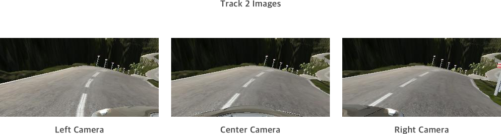
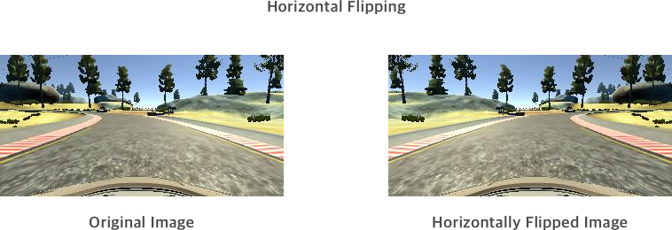
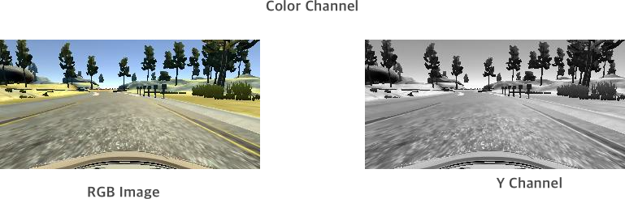
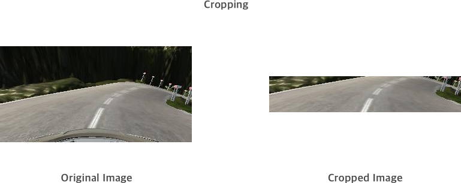
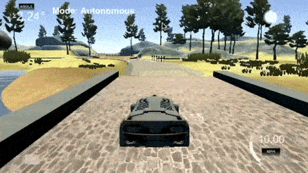

# Behaviour Cloning


The goals  of this project are the following:
* Use the simulator to collect data of a good driving behavior.
* Build, a convolution neural network in Keras that predicts steering angles from images.
* Train and validate the model with a training and validation set.
* Test that the model successfully drives around track one (potentially track 2) without leaving the road.


## Project Exploration


### Dataset

The dataset used in this project were the images captured from driving around the tracks in the stimulator and the corresponding **steering angle** of the car during that time.  The images were **RGB** with dimensions of **160 x 320 x 3** ( height x width x channels) while the steering angle was in the range of [-1, 1]  with negative steering angles indicating steering counter clockwise to turn the car left. 

At a point in time three images were captured. One from the center camera and one each from the left and right cameras providing a viewpoint from the left and right side of the car windshield respectively.  To adjust the steering angle for the images captured from the left and right  cameras a small adjustment was made in the steering angle. This was done by trial and error as the range of values was small enough. 

All in all **54780** images were used. The data can further be broken down into the following categories : 

- Track 1 data : **24108 images** ( provided by Udacity ) 
- Track 2 data : **29355 images** ( two laps around the second track captured using the stimulator)
- Corner driving on track 1 : **1137  images** ( driving around the corner on the first track to balance out the dataset a little bit)

Following are the examples of the images captured on track 1 and track 2 from the left, center and right cameras. 





#### Preprocessing the data : 

- **Horizontal Flipping** : To increase the amount of samples available to the network to train, each of the images was flipped horizontally and the steering angle was multiplied by **-1**. 



- **Color Channel** : The model was trained using an RGB image, a YUV image and just the **Y channel**. Out of these the best performance was achieved by using just the **Y channel**. The thinking about choosing the Y channel was based on the Traffic Sign Classification project I did recently where emphasis had to be put on the edges rather than the colors in the image and hence the model would generalise better in various environments with different backdrops. 



- **Cropping** : The images were also cropped by the model before training the network. The final dimensions of the images used were **60 x 320 x 1**. This was done to remove background elements such as the trees/sky/hood of the car and hence help the model generalise better on different tracks. 



### Training, Validation and Testing

The data was randomly shuffled a training/validation split of 80/20 was carried out.  This left us with : 

- Training Images : 87648
- Validation Images : 21912

No testing data was required as the model was tested directly by letting the car drive autonomously on the track. Two tracks were provided with the second track being much harder to drive on. So much so that in the end the model did a much better job of driving around the second track than I could. 


### Model Architecture and Training Strategy

#### Designing the model

A couple of model designs were used as the basis for designing my model. The first model used was the one from the **[Comma AI](https://github.com/commaai/research/blob/master/train_steering_model.py)** team and the second model was based on the **[paper](http://images.nvidia.com/content/tegra/automotive/images/2016/solutions/pdf/end-to-end-dl-using-px.pdf)** by the NVIDIA team. From the initial tests the model by the NVIDIA team performed better and was hence chosen as the basis for building my model. 

#### Final Model Architecture

The final model consisted of 4 convolutional layers ( instead of the 5 in the NVIDIA model)  with 5 x 5 filter sizes and filter depths ranging from 24 to 64. The 5th convolutional layer was removed as our images consisted of just one channel and did not have enough information subsequently to go through the 5th convolutional layer.

The convolutional layers were followed by 3 dense layers and 1 final output layer. All the layers used **RELU** activation. 

**Adam** optimiser with a learning rate of **0.01** was used to train the model. 

```
Layer (type)                     Output Shape          Param #     Connected to
====================================================================================================
cropping2d_1 (Cropping2D)        (None, 70, 320, 1)    0           cropping2d_input_1[0][0]
____________________________________________________________________________________________________
lambda_1 (Lambda)                (None, 70, 320, 1)    0           cropping2d_1[0][0]
____________________________________________________________________________________________________
convolution2d_1 (Convolution2D)  (None, 33, 158, 24)   624         lambda_1[0][0]
____________________________________________________________________________________________________
batchnormalization_1 (BatchNorma (None, 33, 158, 24)   96          convolution2d_1[0][0]
____________________________________________________________________________________________________
convolution2d_2 (Convolution2D)  (None, 15, 77, 36)    21636       batchnormalization_1[0][0]
____________________________________________________________________________________________________
batchnormalization_2 (BatchNorma (None, 15, 77, 36)    144         convolution2d_2[0][0]
____________________________________________________________________________________________________
convolution2d_3 (Convolution2D)  (None, 6, 37, 48)     43248       batchnormalization_2[0][0]
____________________________________________________________________________________________________
batchnormalization_3 (BatchNorma (None, 6, 37, 48)     192         convolution2d_3[0][0]
____________________________________________________________________________________________________
convolution2d_4 (Convolution2D)  (None, 4, 35, 64)     27712       batchnormalization_3[0][0]
____________________________________________________________________________________________________
batchnormalization_4 (BatchNorma (None, 4, 35, 64)     256         convolution2d_4[0][0]
____________________________________________________________________________________________________
convolution2d_5 (Convolution2D)  (None, 2, 33, 64)     36928       batchnormalization_4[0][0]
____________________________________________________________________________________________________
batchnormalization_5 (BatchNorma (None, 2, 33, 64)     256         convolution2d_5[0][0]
____________________________________________________________________________________________________
flatten_1 (Flatten)              (None, 4224)          0           batchnormalization_5[0][0]
____________________________________________________________________________________________________
dense_1 (Dense)                  (None, 100)           422500      flatten_1[0][0]
____________________________________________________________________________________________________
batchnormalization_6 (BatchNorma (None, 100)           400         dense_1[0][0]
____________________________________________________________________________________________________
activation_1 (Activation)        (None, 100)           0           batchnormalization_6[0][0]
____________________________________________________________________________________________________
dropout_1 (Dropout)              (None, 100)           0           activation_1[0][0]
____________________________________________________________________________________________________
dense_2 (Dense)                  (None, 50)            5050        dropout_1[0][0]
____________________________________________________________________________________________________
batchnormalization_7 (BatchNorma (None, 50)            200         dense_2[0][0]
____________________________________________________________________________________________________
activation_2 (Activation)        (None, 50)            0           batchnormalization_7[0][0]
____________________________________________________________________________________________________
dense_3 (Dense)                  (None, 10)            510         activation_2[0][0]
____________________________________________________________________________________________________
activation_3 (Activation)        (None, 10)            0           dense_3[0][0]
____________________________________________________________________________________________________
dense_4 (Dense)                  (None, 1)             11          activation_3[0][0]
====================================================================================================
Total params: 559,763
Trainable params: 558,991
Non-trainable params: 772
```


#### Preventing overfitting : 

A number of techniques were tried to prevent overfitting: 


- **Dropout Layers** : At first dropout layers were added after all the dense layers. However this lead to excessive loss of information. Subsequent removal of the dropout layers from the last two dense layers greatly increased the accuracy of the model. Hence in the final model the dropout layer was added only after the largest dense layer.

- **L2 Regularization** : L2 regularisation was tried to prevent overfitting but using it lead to much slower convergence and longer training times with not much increase in accuracy. Hence L2 Regularization was not used in the final model.

- **Batch Normalization** : A batch normalization layer was added after every layer except the last two. This led to the greatest increase in accuracy and helped the model generalise better. Batch normalization also allowed us to increase the learning rate by a factor of 10 and hence led to faster training times.

- **Early Stopping** : Early stopping was used to stop training of the model once it started overfitting. This can be easily done in **Keras** by providing a *callback*. 

In the end the model trained for **12 epochs**, terminating early due to *early stopping*. 

### Conclusion

 

In the end the model was able to generalise well enough to drive well on both the tracks endlessly without any manual intervention.  The model can be improved further by augmenting the data more, collecting more data and trying other architectures. Despite understanding everything happening under the “hood” working on the project felt nothing short of magical and makes me feel very excited about the future of autonomous driving. 

---


## Usage 
Once you have [Anaconda]() installed create the environment using the provided **environment.yml** file. Activate the created environment
```
conda env create -f environment.yml
source activate carnd-term1
```

Clone this project

```
git clone https://github.com/manibatra/Behaviour-Cloning.git
cd Behaviour-Cloning
```

Download the simulator and the sample data provided. 
- [Simulator](https://d17h27t6h515a5.cloudfront.net/topher/2017/February/58ae4594_mac-sim.app/mac-sim.app.zip)
- [Sample Data for track 1](https://d17h27t6h515a5.cloudfront.net/topher/2016/December/584f6edd_data/data.zip) , [Corresponding log file](https://raw.githubusercontent.com/mithi/behavioral-cloning/master/data/driving_log.csv)
- You will have to record data for track 2 using the simulator if you want to drive car on both tracks.

Add path(s) to the data in the **model.py** file.  For e.g

```
paths = [‘./track_1_data/‘, ‘./track_2_data/‘, ‘./patch/‘]
```

Train the model

```
python model.py
```

Use the **drive.py** file to  predict the steering angle based on the trained model.

```
python drive.py saved_model.h5
```

Select the track and **Autonomous Mode** in the simulator and enjoy autonomous driving. 

